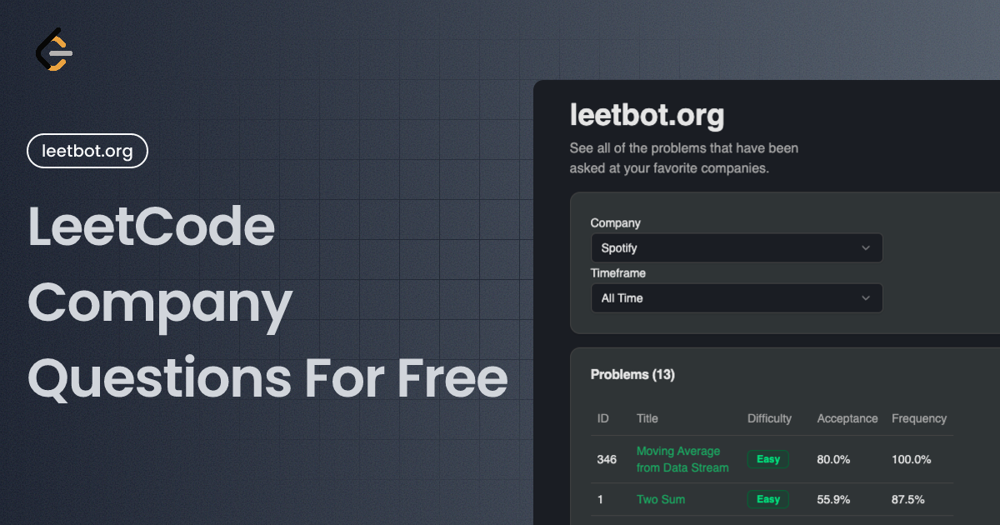
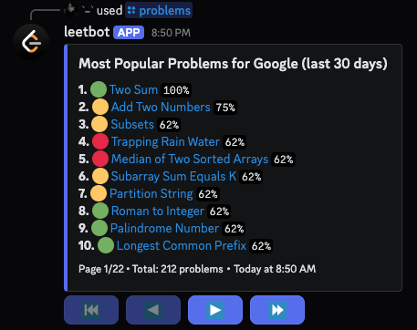
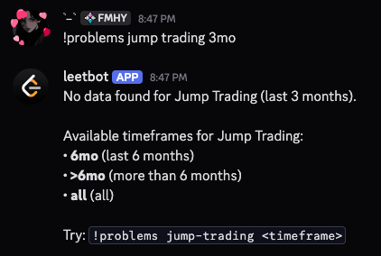

# [leetbot.org](https://leetbot.org)

A [Discord bot](https://discord.com/oauth2/authorize?client_id=1431162839187460126&permissions=2147559424&integration_type=0&scope=bot+applications.commands) and a [web interface](https://leetbot.org) that emits coding interview problems (derived from [leetcode.com](https://leetcode.com/)) by company using the [discordgo](https://github.com/bwmarrin/discordgo) library.





- leetbot [embeds](https://pkg.go.dev/embed) `csv` files within the compiled binary keeping latency near zero ✅
- leetbot uses a custom paginator implementation [inspired by `dgo-paginator`](https://github.com/topi314/dgo-paginator) to paginate results ✅
- leetbot supports both text (`!problems google`) and slash commands (`/problems google`) ✅
- leetbot supports suggestions, autocompletion, [fuzzy search](https://pkg.go.dev/github.com/lithammer/fuzzysearch@v1.1.8), and validation for company names ✅
- leetbot supports multiple timeframes (`all`, `30d`, `3mo`, `6mo`, `>6mo`) ✅

## Commands

The bot supports both text commands (with prefix `!`) and slash commands (with prefix `/`) for native interactions.

### Slash Commands (Reccomended)
```
/problems company:<company> [timeframe:<timeframe>]
/help
```

### Text Commands (Legacy)
```
!problems <company> [timeframe]
!help
```

**Examples:**
- `!problems airbnb` or `/problems company:airbnb` - Show most popular problems for Airbnb (all time)
-  `!problems susquehanna >6mo`
-  `!problems amazon 30d`
-  `!problems HRT all`

**Supported timeframes:**
- `all` (default) - All time
- `thirty-days`, `30-days`, `30d` - Last 30 days
- `three-months`, `3-months`, `3mo` - Last 3 months
- `six-months`, `6-months`, `6mo` - Last 6 months
- `more-than-six-months`, `>6mo` - More than 6 months ago

> [!NOTE]
> Leetbot uses a priority system to determine the default timeframe if no timeframe is specified.
> It will try to use the most recent timeframe that has data first.
> If no data is found, it will use the next most recent timeframe until it reaches the default timeframe (all time).

## Setup locally

### Prerequisites

- Go 1.24 or later
- Discord Bot Token
- Bot must be added to your Discord server with `application.commands` scope

### Discord Bot Setup

1. Go to [Discord Developer Portal](https://discord.com/developers/applications)
2. Create a new application or use an existing bot
3. Go to **OAuth2** → **URL Generator**
4. Select scopes: `bot` and `applications.commands`
5. Select permissions: `Send Messages`, `Use Slash Commands`, `Send Messages in Threads`, `Read Message History`, `Embed Links`, `Use External Emojis`, and `Add Reactions`
6. Use the generated URL to add the bot to your server

### Installation

1. Clone the repository:
```bash
git clone https://github.com/whotypes/leetbot
cd leetbot
```

2. Copy environment file and configure:
```bash
cp .env.example .env
```

> [!IMPORTANT]
> Be sure to update the .env file with your actual Discord bot token.

3. Install dependencies:
```bash
make setup
```

4. Run the bot in development mode:
```bash
make dev
# or
go run ./cmd/bot
# or
make run
```


## Development

### Available Make Commands

- `make help` - Show available commands
- `make dev` - Run with live reload using air
- `make lint` - Run linter
- `make test` - Run tests
- `make test-coverage` - Run tests with coverage report
- `make build` - Build the application
- `make build-server` - Build the HTTP server
- `make build-web` - Build the React frontend
- `make build-all` - Build both server and frontend
- `make run` - Build and run the application
- `make run-web` - Build and run the web server
- `make run-server` - Build and run the HTTP server
- `make clean` - Clean build artifacts
- `make docker-build` - Build Docker image
- `make docker-run` - Run Docker container
- `make validate` - Run linting and tests
- `make setup` - Setup development environment
- `make generate-embedded` - Generate embedded CSV data from actual files
- `make validate-data` - Validate all CSV files in data directory
- `make demo` - Run the bot demo

### Adding New Companies

1. Create a new directory under `data/`:
```bash
mkdir data/new-company
```

2. Add CSV files for each timeframe (all.csv, thirty-days.csv, etc.)

3. Update `internal/data/parser.go`:
   - Add embed directives for the new CSV files
   - Add the company to the `embeddedCSVs` map

> [!TIP]
> Run `make generate-embedded` to generate the embedded data automatically.

### Refreshing company data from LeetCode

To refetch and merge the latest company-tagged problem lists (GraphQL) into `data/` and regenerate `internal/data/parser_generated.go`, export your browser cookies as a Netscape file and save it at the repository root as `leetcode_cookies_netscape.txt` (must include `LEETCODE_SESSION` and `csrftoken`). From the repository root run:

```bash
go run ./scripts/refresh_leetcode_data
```

The command walks every company in the problem-set company dropdown (or one company with `-company <slug>`), appends new rows by problem ID without removing or overwriting existing rows, and then runs the embedded generator. If LeetCode returns no questions for a timeframe, any existing CSV is left unchanged. A single-company test skips manifest and embed unless you pass `-embed`:

```bash
go run ./scripts/refresh_leetcode_data -company google
```

To delete **header-only** CSVs left over under `data/` (no data rows), run from the repo root:

```bash
go run ./scripts/cleanup_empty_data_csv
```

This does not remove empty directories; you can prune those separately if you want (e.g. `find data -type d -empty`). Afterward, regenerate embedded data: `go run scripts/generate_embedded/main.go ./data`. A full run issues many API calls and can take a long time; if the session or Cloudflare challenge expires, refresh the cookie file and run again. Do not commit live cookie files.

## CSV Format

CSV files should have the following columns:
- `ID` - LeetCode problem ID
- `URL` - LeetCode problem URL
- `Title` - Problem title
- `Difficulty` - Easy/Medium/Hard
- `Acceptance %` - LeetCode acceptance rate
- `Frequency %` - How often this problem appears in interviews (used for sorting)

Example:
```csv
ID,URL,Title,Difficulty,Acceptance %,Frequency %
1,https://leetcode.com/problems/two-sum,Two Sum,Easy,55.9%,100.0%
2,https://leetcode.com/problems/add-two-numbers,Add Two Numbers,Medium,46.4%,75.0%
```

## Docker

Build and run with Docker:

```bash
make docker-build
make docker-run
```

## Taking Leetbot to Production

For a quick path, build the binary and run it anywhere that fits (Fly.io, a VPS, etc.) with the right env vars. Cheers to go:

```bash
make build
./bin/leetbot
```

There’s also an [`ansible/`](./ansible/) playbook for a single Ubuntu host: Docker + compose for the app, nginx reverse proxy, UFW, Let’s Encrypt (optional via `leetbot_ssl_email` in `group_vars`), fail2ban, etc.

1. Point your domains at the server: main site uses `leetbot_app_domains`, analytics UI uses `leetbot_analytics_domains` (see [`ansible/group_vars/all.yml`](./ansible/group_vars/all.yml)); together they populate TLS SANs via `leetbot_public_domains`.
2. Put your host in [`ansible/inventory.yml`](./ansible/inventory.yml) and set secrets in encrypted [`ansible/group_vars/vault.yml`](./ansible/group_vars/vault.yml) as needed. Use `vault_discord_token` for the bot, `vault_postgres_password` for the bundled Postgres/Metabase stack, and a strong value (avoid raw `@` or `:` in the password, or URL-encode them in `DATABASE_URL` if you customize templates). A Discord bot token is only required if you’re running the bot; if you’re only self-hosting the website / HTTP side, you can leave that out (or empty) and trim [`ansible/.env.j2`](./ansible/.env.j2) so the container isn’t expecting a token.
3. From the `ansible/` directory:
```bash
ansible-galaxy collection install -r requirements.yml
ansible-playbook playbook.yml --ask-vault-pass
```

**HTTPS:** Nginx uses **`leetbot_letsencrypt_live_app`** and **`leetbot_letsencrypt_live_analytics`** (defaults in [`ansible/group_vars/all.yml`](./ansible/group_vars/all.yml)) under `/etc/letsencrypt/live/…`. They must match your Certbot **certificate names**. Separate certs for the main site vs analytics are supported; for **one** certificate that covers every hostname, set both vars to the same directory name (usually `leetbot_app_domains[0]`).

**Before running the playbook again:** On the VPS you usually **do not need to change anything**—pull latest git on your **admin machine**, then run `ansible-playbook` so the nginx template is redeployed. Optionally SSH in and run `sudo nginx -t` and `sudo certbot certificates` to confirm paths match [`leetbot.conf.j2`](ansible/roles/nginx/templates/leetbot.conf.j2). After the playbook, reload is handled by Ansible handlers.

The `leetbot` role clones this repo on the server under `/opt/leetbot` and runs `docker compose` there. 

## License

This project is licensed under the [GNU General Public License v3.0](https://www.gnu.org/licenses/gpl-3.0.html)!
